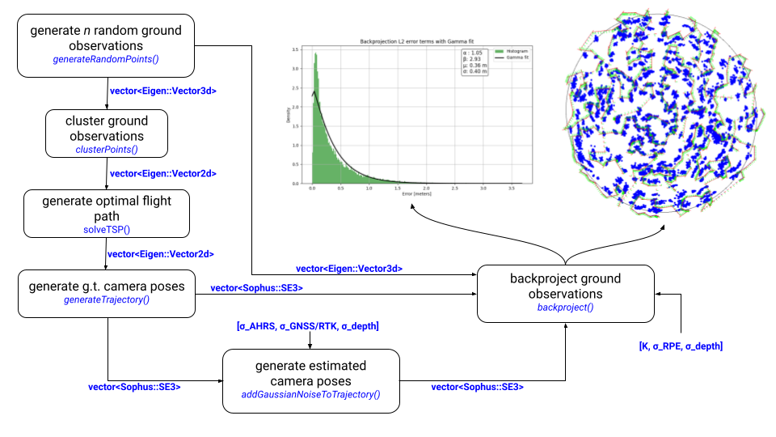

# birdseye simulator

**3D simulator for system analysis and visualization**

<p align='center'>
    
</p>

## Installation

This software uses [Eigen](https://eigen.tuxfamily.org/index.php?title=Main_Page) for linear algebra operations, [Sophus](https://github.com/strasdat/Sophus) for Lie groups and 3D transformations, and [Pangolin](https://github.com/stevenlovegrove/Pangolin) for smooth visualization. Install these software dependencies using the following command on Ubuntu. 

```bash
sudo apt-get install cmake libeigen3-dev libpangolin-dev libsophus-dev libyaml-cpp-dev
```

To build this simulator, run
```bash
git clone https://github.com/harelab-ucsc/birdseye.git
cd birdseye/sim
mkdir build
cd build
cmake ..
make
```

## Usage

The simulation and system parameters are specified in a yaml file. An example is provided in the config directory. To run the simulator, simply type the following in the root of this subdirectory.

```bash
./build/sim3D config/sim.yaml
```

The simulation provides Euclidean backprojection error terms in a file called l2_errors.txt. To anaylze this output, we provide a script that fits a gamma function to the error distribution.

```bash
python3 scripts/analyze.py --bins 250 l2_errors.txt
```
